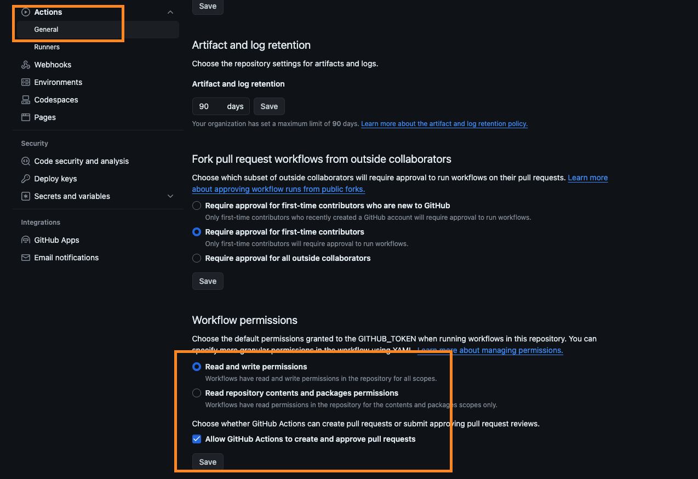
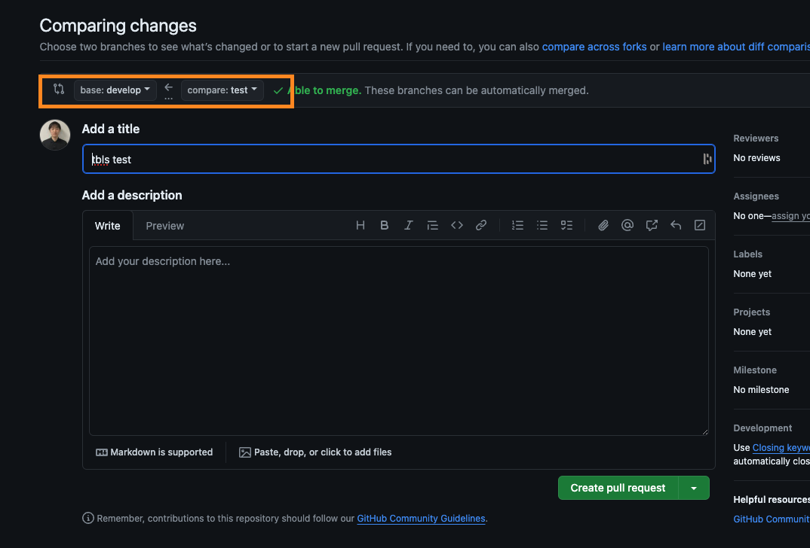
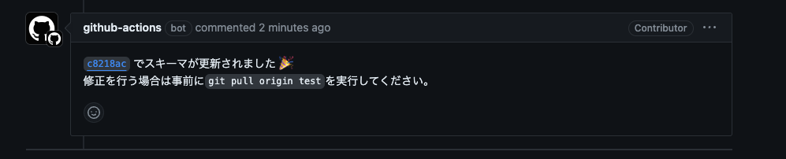

# 目次
- [1 tbls](#tbls)
- [2 schemaspy](#schemaspy)
- [3 MKDocs](#mkdocs)


# パッケージインストール
```bash
$ pnpm install
```

# tbls

## セットアップ
1. Homebrewでtbldツールをインストール
    ```bash
    $ brew install k1LoW/tap/tbls
    ```

2. パッケージインストール
    ```bash
    $ pnpm install
    ```

3. Docker起動
    ```bash
    $ docker-compose up -d
    ```
    * Dockerでtbls docを実施することも可能だが、現在は無効にしている。

4. マイグレーションファイル作成(更新がある場合のみ)
    ```bash
    $ pnpm db-generate
    ```

5. DBマイグレーション
    ```bash
    $ pnpm db-migrate
    ```

6. Github Actionsのworkflow permissionsを更新 (Github ActionsからCommit & pushできるように)


7. Github Actionsでtblsドキュメントを自動更新し、PRのコメントに詳細を記載
    * Github Actions workflows起動条件: schemaファイルを更新し、`develop'ブランチにPull Request
    
    

8. PRをdevelopにmerge

9. developでPRを作り、mainにmerge

10. 作業終了後) Docker終了
    ```bash
    $ docker-compose down
    ```

## github actionsをローカルで実施 (現在は、`disabled`ディレクトリに格納中)
1. rootフォルダに`.actrc`を新規作成し、以下設定
    ```bash
    -P mysql:8.0=mysql:8.0
    -s GITHUB_TOKEN=XXXX
    ```

2. `pnpm tbls-act`実施
    * `tbls-doc-local.yml`ファイルで記載されたアクションが実施され、`docs/dbdoc/act-local`にtblsファイルが生成される。


## tblsとは
* Databaseのスキーマを基に自動でDocumentationを作成するツール
* 主なtblsコマンド
    * `tbls doc`: Databaseのスキーマ情報をベースにドキュメントを作成
    * `tbls diff`: Databaseのスキーマ情報と現在のtbls docファイルの差分を表示
* 必要なファイル
    * `.tbls.yml`: configファイル。DSN(Database Source Name)やファイルの出力先を設定。ViewpointやCommentなどを設定できる。

## 特徴
### 🙆

* tblsでできること
    * Viewpoint: データベースのスキーマに対する特定の視点やフィルタリングを設定・管理
    * Comment: テーブルやカラムにコメントを記載
    * Label: ラベル付
    * Lint: スキーマ定義に対するLintの設定

### 🙅
* ある程度のカスタマイズはできるが、schemaspyほどの機能はない?(例: Anoalisで不整合テーブル検出など?)


## 使用検討案
* Github ActionsでCI/CDを実施することは可能だが、DBをCloud SQLで管理していることを考えると、Cloud Buildのプロセスにtbls docを含めた方が効率的？(Github actionsだとイベントリスナーでCloud Buildのmigration完了をListenした上で、Actions workflowを開始するする必要あり?)
    * 例1) `cloudbuild.yaml`でmigrationファイルに変更があったら、Cloud SQL Auth Proxy実施=>migration実行=>データベース更新=>tbls doc更新
        * ただし、Build内で直接DBを更新するのはリスクがある？
    * 例2) `cloudbuild.yaml`でmigrationファイルに変更があったら、Cloud SQL Auth Proxy実施=>別のDBに反映=>それを本番のDBに反映


### 参考文献
- [tbls公式Doc](https://github.com/k1LoW/tbls/blob/main/README.md#environment-variables)
- [tbls と GitHub Actions を使ったスキーマ情報を管理する仕組みについて検証しました](https://developer.so-tech.co.jp/entry/2023/05/15/103745)
- [ドキュメント整備のためにtblsを導入してみた話](https://qiita.com/helloworld193/items/f07d75325726e7425fb4#%E5%B0%8E%E5%85%A5%E6%96%B9%E6%B3%95)
- [DBスキーマはtblsのViewpointsで整理しよう](https://zenn.dev/micin/articles/2023-12-05-majimaccho-tbls)
- [2024/04/23 tbls活用事例 〜 ビューポイントから データベースを整理してみた話 〜](https://speakerdeck.com/tosite/23-tblshuo-yong-shi-li-biyupointokara-detabesuwozheng-li-sitemitahua?slide=59)
- [tblsとGitHub Actionsを使ってDBマイグレーションを含むPRには自動更新したER図を追加する](https://devblog.thebase.in/entry/auto_generated_er_graph_by_tbls_and_github_actions)
- [v06 The future of tbls and Documentation as Code](https://www.youtube.com/watch?v=b3TePTDCNgg)
- [tblsを使って db schema document作成自動化](https://zenn.dev/gakin/scraps/57e4c675e35bf5)
- [tblsのViewPoint機能を用いたGithub Actions上でのDBドキュメントの自動生成(mkdocs使用)](https://engineers.safie.link/entry/2023/12/02/build-db-doc-by-tbls)

[目次に戻る](#目次)


# schemaspy

## 事前セッティング(インストール/ ダウンロード)

* (Java 8のインストール)[https://www.java.com/ja/download/]

* (Graphvizのインストール)[https://www.graphviz.org/download/]
    ```bash
    $ brew install graphviz 
    ```

* (JDBCドライバのダウンロード)[https://www.mysql.com/products/connector/]
    * `JDBC Driver for MySQL (Connector/J)`>`Platform Independent`を選択
    * ダウンロードしたjarファイルを`mysql-connector-j-9.0.0`を対象ディレクトリに格納

* (Schemaspy Jarfileのダウンロード)[https://github.com/schemaspy/schemaspy/releases]
    * 最新versionのjarファイルを対象ディレクトリに格納


## 使用方法
### A: コマンドにconfig情報直接入力=>outputファイル作成 (◯)
```bash
java -jar ./schemaspy-6.2.4.jar \
    -t mysql \
    -dp ./mysql-connector-j-9.0.0.jar \
    -db parking_app \
    -host localhost \
    -port 3306 \
    -s parking_app \
    -u root \
    -o ./output \
    -hq /opt/homebrew/bin/dot \
    -imageformat svg \
    -imagefontadjust true
```
* Graphviz rendererについて以下のようなエラーが多く発生するが、無視して良さそう。((根拠 from Github issues)[https://github.com/schemaspy/schemaspy/issues/833])
```bash
.ERROR - dot ~~ Warning: cell size too small for content
```

### B: Configファイルを作成 => コマンドでconfigファイルを参照=>outputファイル作成(×: エラー解決できず、index.htmlが生成されない)
* `schemaspy.properties`で設定情報を記載=>`$ java -jar ./schemaspy-6.2.4.jar \ -configFile schemaspy.properties`を実行

* 以下のようなエラーが発生する。Javaランタイムが認識するクラスファイルバージョンが古いのが原因。Versionを11に変えれば解消するようだが、まだ解決できていない。
```bash
Caused by: java.lang.UnsupportedClassVersionError: org/openjdk/nashorn/api/scripting/NashornScriptEngineFactory has been compiled by a more recent version of the Java Runtime (class file version 55.0), this version of the Java Runtime only recognizes class file versions up to 52.0
```

### C: Dockerで実施
* 未着手

## schemaspyとは
* Databaseのスキーマを基に自動でDocumentationを作成するツール
* Javaベース

## 特徴

### 🙆
* 各テーブル、及びそのER図をサイトとして一覧できる。
* Anomaliesで不整合なテーブルを検出できる。
* Orphan Tablesで他テーブルとのRelationがないものを検出できる。
* Searchでテーブルレベル、テーブル内のカラムレベルの検索が可能。

### 🙅
* 各テーブル・カラムに対するコメントの記載や、テーブルをカテゴライズなどのカスタマイズがしにくい？
* index.htmlを参照するためには、github pagesなどを使用する必要がある。ただし、github pagesはpublicでないとサイトを公開できない。Private公開&内部でのみサイトを公開するためには、Github Enterpriseを使用する必要がある？

## 参考文献
* [公式ドキュメント](https://schemaspy.org/)
* [Github](https://github.com/schemaspy)
* [SchemaSpyを使ってER図を自動で作る](https://zenn.dev/politive/articles/3efb08d5cafc63#%E6%A6%82%E8%A6%81)
* [Specifying the renderer from schemaspy's issue](https://github.com/schemaspy/schemaspy/issues/33)
* (MacでスタイリッシュなER図を作成する(Oracle))[https://qiita.com/uhooi/items/83e70e32d5bd7f12af8a#jdbc%E3%83%89%E3%83%A9%E3%82%A4%E3%83%90%E3%81%AE%E3%83%80%E3%82%A6%E3%83%B3%E3%83%AD%E3%83%BC%E3%83%89]
*[Create MS SQL Database documentations using SchemaSpy](https://www.youtube.com/watch?v=Cev4jEvppsk)
* [SchemaSpyでデータベースのドキュメントを生成してみた](https://dev.classmethod.jp/articles/schemaspy-doc/)
* [docker compose 上で SchemaSpy が動かないのを直す (MySQL 8, Apple M1 Mac)](https://qiita.com/mikankari/items/785cb00d8b7b1f563f13)
* [SchemaSpyを使ってER図を自動で作る](https://zenn.dev/politive/articles/3efb08d5cafc63#%E6%A6%82%E8%A6%81)
* [SchemaSpyを使ってデータベースの中身をまとめたかった](https://qiita.com/kazuyaseo/items/4dc76d4d2847f009c3bb)

[目次に戻る](#目次)

# MKDocs

## セットアップ
1. 仮想環境 (venv) を設定
    ```bash
    $ python3 -m venv venv

    $ source venv/bin/activate

    $ pip install mkdocs-material

    $ mkdocs new .

    $ mkdocs serve //2回目以降はserveのみでOK

    ```
    * 使用終了時に、`$ deactivate`して仮想環境も終了する。

2. `mkdocs.yml`(1で自動生成)でカスタマイズ
    * 多言語設定可能
        * `$ pip install mkdocs-static-i18n`インストール
        * i18nプラグイン設定必要
    * docs傘下の特定のフォルダをbuildの除外に設定
        * a) `$ pip install mkdocs-exclude`
        * b) `mkdocs.yml`のpluginで設定
    * Version管理
        * a) `$ pip install mike`
        * b) `mkdocs.yml`のpluginで設定
        * c) `$ mike deploy --push --update-aliases [version] latest`で指定のversionをデプロイ
        * d) `$ mike serve`=>`http://localhost:8000/version/`にアクセス => versionタブで各versionに移動可能
        * e) Github Actions用のymlファイル作成 + Github Pagesの設定を変更

3. `mkdocs serve`でローカル環境でサイトアクセス可能

4. `mkdocs build`でサイトビルド

5. Github actionsでGithub pagesにデプロイ (`.github/workflows/mkdocs-generate.yml`)


## MKDocsとは
* Pythonベースで実装されるドキュメントサイトを生成するための静的サイトジェネレーター
* Markdown形式のファイルを読み込み、ドキュメントを生成

## 特徴

### 🙆
* テーマや多言語設定、Nav・サイドバーなどカスタマイズが可能
* docs直下フォルダが一つのセクションとみなされ、タブになる。1フォルダ = 1セクションでシンプル。
* 多分、Version管理もできる。[こちら](https://qiita.com/laughingman/items/353b9cffb28c4af38b34)
* Markdown言語しだけでなく、HTMLファイルも認識する。(Path指定してリンクからアクセス可能/ ビルド後にスタイルが消える問題が発生中)

### 🙅
* MKDocs

## 参考文献
* [MkDocs + plugin : mkdocs-static-i18n で多言語対応サイトを構築する](https://qiita.com/tomoten/items/26706f2eafe84f70b1a6)
* [my-mkdocs-mike in github](https://github.com/tomoten-umino/my-mkdocs-mike/tree/master)
* [mkdocs-static-i18n in github](https://github.com/ultrabug/mkdocs-static-i18n)
* [MkDocsによるドキュメント作成](https://zenn.dev/mebiusbox/articles/81d977a72cee01)
* [Material for MkDocs](https://squidfunk.github.io/mkdocs-material/)
* [mkdocsをMacにインストールする。](https://qiita.com/TakeoChan/items/652c6bdeb6158e961039)
* [MkDocs Installation](https://www.mkdocs.org/user-guide/installation/)
* [MkDocsによるドキュメント作成](https://zenn.dev/mebiusbox/articles/81d977a72cee01)
* [rails-schemaspy-example in github](https://github.com/hkato/rails-schemaspy-example/tree/main)
* [mkdocs-material-youtube-tutorial in github](https://github.com/james-willett/mkdocs-material-youtube-tutorial)
* [How To Create STUNNING Code Documentation With MkDocs Material Theme in Youtube](https://www.youtube.com/watch?v=Q-YA_dA8C20&t=205s)
* [MkDocs で .git や node_modules など指定ディレクトリを exclude(除外) したい](https://stakiran.hatenablog.com/entry/2019/02/22/210613)
* [MkDocs+Read the Docsで面倒なWordのドキュメント管理から抜け出す](https://qiita.com/laughingman/items/353b9cffb28c4af38b34)
* [Setting up versioning (公式Doc)](https://squidfunk.github.io/mkdocs-material/setup/setting-up-versioning/)
* [Docs versioning: Docusaurus and MkDocs](https://tw-docs.com/docs/static-site-generators/docs-versioning/)
* [mike in github](https://github.com/jimporter/mike)
* [How does Material for MkDocs fetch the latest git tag (to display it in the navbar)? in github discussion](https://github.com/squidfunk/mkdocs-material/discussions/3439)
* [Using Git Information](https://mkdocs-macros-plugin.readthedocs.io/en/latest/git_info/)
* [Github Pagesの公開ページの版管理（MkDocs plugin mike利用）](https://qiita.com/tomoten/items/39b87fc114d8f41b5ebd)

[目次に戻る](#目次)

## 特徴

### 🙆
* 限定公開可能?

### 🙅


## 参考文献
* [GitLab PagesでER図(SchemaSpy)](https://qiita.com/hkato/items/5949485333aad22d4871)
* [Gitlab pagesでサイトへのアクセス制限をする・解除する](https://www.serversus.work/topics/iir5lhcfgivsdxpxgdfb/)
* [GitLabPagesでホームページを公開しよう。](https://qiita.com/flmil/items/13f23425b0fafbfaf982)

[目次に戻る](#目次)

