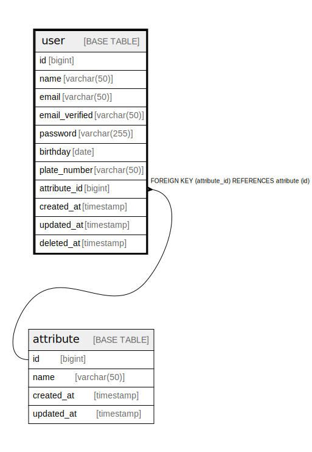

# user

## Description

Users table

<details>
<summary><strong>Table Definition</strong></summary>

```sql
CREATE TABLE `user` (
  `id` bigint NOT NULL AUTO_INCREMENT,
  `name` varchar(50) COLLATE utf8mb4_unicode_ci NOT NULL,
  `email` varchar(50) COLLATE utf8mb4_unicode_ci NOT NULL,
  `email_verified` varchar(50) COLLATE utf8mb4_unicode_ci DEFAULT NULL,
  `password` varchar(255) COLLATE utf8mb4_unicode_ci NOT NULL,
  `birthday` date NOT NULL,
  `plate_number` varchar(50) COLLATE utf8mb4_unicode_ci NOT NULL,
  `attribute_id` bigint NOT NULL,
  `created_at` timestamp NULL DEFAULT NULL,
  `updated_at` timestamp NULL DEFAULT NULL,
  `deleted_at` timestamp NULL DEFAULT NULL,
  PRIMARY KEY (`id`),
  UNIQUE KEY `user_email_unique` (`email`),
  KEY `user_attribute_id_attribute_id_fk` (`attribute_id`),
  KEY `name_idx` (`name`),
  CONSTRAINT `user_attribute_id_attribute_id_fk` FOREIGN KEY (`attribute_id`) REFERENCES `attribute` (`id`)
) ENGINE=InnoDB DEFAULT CHARSET=utf8mb4 COLLATE=utf8mb4_unicode_ci
```

</details>

## Labels

`user` `privacy data`

## Columns

| Name | Type | Default | Nullable | Extra Definition | Children | Parents | Comment |
| ---- | ---- | ------- | -------- | ---------------- | -------- | ------- | ------- |
| id | bigint |  | false | auto_increment |  |  |  |
| name | varchar(50) |  | false |  |  |  |  |
| email | varchar(50) |  | false |  |  |  | Email address as login id. ex. user@example.com |
| email_verified | varchar(50) |  | true |  |  |  |  |
| password | varchar(255) |  | false |  |  |  |  |
| birthday | date |  | false |  |  |  |  |
| plate_number | varchar(50) |  | false |  |  |  |  |
| attribute_id | bigint |  | false |  |  | [attribute](attribute.md) |  |
| created_at | timestamp |  | true |  |  |  |  |
| updated_at | timestamp |  | true |  |  |  |  |
| deleted_at | timestamp |  | true |  |  |  |  |

## Viewpoints

| Name | Definition |
| ---- | ---------- |
| [User情報](viewpoint-0.md) | User情報に関するドキュメント |

## Constraints

| Name | Type | Definition |
| ---- | ---- | ---------- |
| PRIMARY | PRIMARY KEY | PRIMARY KEY (id) |
| user_attribute_id_attribute_id_fk | FOREIGN KEY | FOREIGN KEY (attribute_id) REFERENCES attribute (id) |
| user_email_unique | UNIQUE | UNIQUE KEY user_email_unique (email) |

## Indexes

| Name | Definition |
| ---- | ---------- |
| name_idx | KEY name_idx (name) USING BTREE |
| user_attribute_id_attribute_id_fk | KEY user_attribute_id_attribute_id_fk (attribute_id) USING BTREE |
| PRIMARY | PRIMARY KEY (id) USING BTREE |
| user_email_unique | UNIQUE KEY user_email_unique (email) USING BTREE |

## Relations



---

> Generated by [tbls](https://github.com/k1LoW/tbls)
